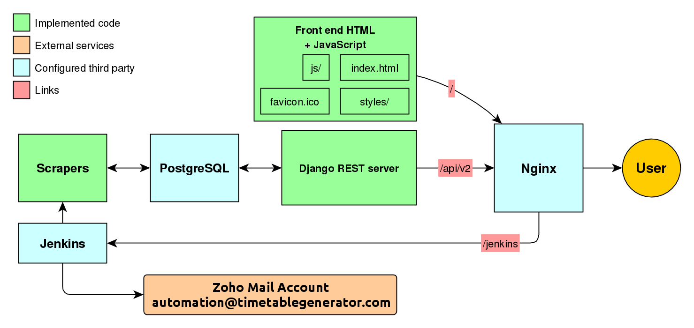
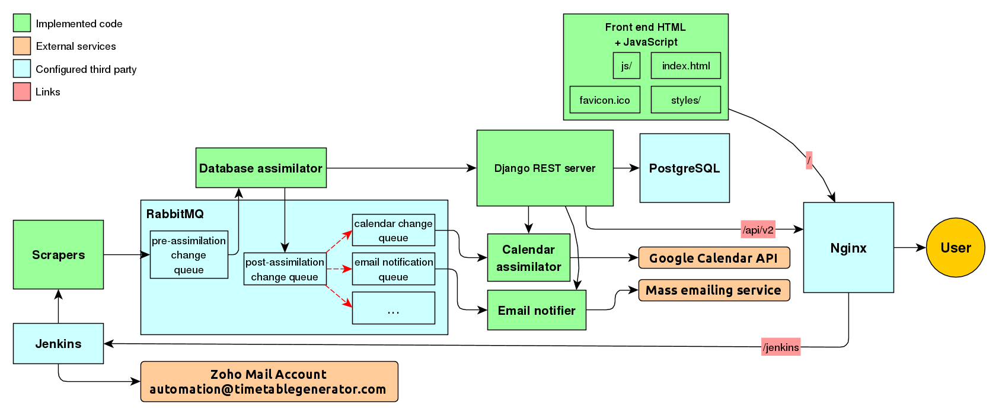

# Road map for the Timetable Generator

The Timetable Generator has been relatively quiet from a development perspective since the first release. Most changes that have occurred have been in the backend, but almost none of them are visible from the user perspective.

The objective of this document is to establish development goals to promote more regular development cycles and to make it easier to add additional developers to the project.

## Current implementation

**This section will be updated periodically to try and reflect the current state of the system as accurately as possible**

This diagram represents the current state of the system.

The Timetable Generator is currently composed of several components. They will be described in the following headings.

##### Scrapers
The scraper project is responsible for refreshing scheduling content from the various universities. The scrapers run periodically via Jenkins, which logs and reports any failures via email. Each supported university has its own scraper, which typically are run once per day. The link to the Jenkins server is http://www.timetablegenerator.com/jenkins.

##### API backend
The backend is a simple NodeJS + express server for serving the content generated by the scrapers. This also functions as the proxy to *tinyurl.org* for storing and retrieving saved timetables. This API is very minimalistic at the moment and has an endpoint of http://www.timetablegenerator.com/api/v1.

The API is implemented with the following URLs:
- /api/v1/school/**&lt;school_id&gt;**
- /api/v1/school/**&lt;school_id&gt;**/legacy
- /api/v1/school/**&lt;school_id&gt;**/refresh
- /api/v1/schedule/**&lt;schedule_key&gt;**

The Timetable Generator's API only returns a supported school's *entire* course scheduling content for the present time period. Presently, there aren't any formal analytics collected, but on average, there are always at least a few things that change across all universities.

There are presently two supported formats for this data: the *legacy* format and the *future* format.

The legacy format is what is presently live in production. It's capable of documenting course scheduling for schools that are similar to *McMaster University*, meaning schools that only have 3 course subunit types: tutorials, labs, and lectures, and first semester, second semester, and full year scheduling. This was quickly proven to be insufficient, and so the future format was created with significantly more flexibility to adapt to more schools. This format is also invulnerable to a bug in the legacy format, which could cause saved schedules to break if an unrelated course is removed from the same department as one saved.

Unfortunately, the front end still does not support the future format, and so the API generates both. Some schools (e.g. Waterloo) are only supported by the future format due to the legacy format being too unfit to accurately represent their data.

Currently, the future format is being utilized by a different project called *Roomer*. This format will be the standard for any other external projects that appear in the future.

The legacy format is not documented as it is expected that the front end of the website will be replaced from the ground up rather than adapted to something new.

The `/school/<school_id>/refresh` endpoint is used by Jenkins to tell the API to re-cache the data from new files generated by the scraper for a particular school.

The `/schedule/<schedule_key>` format is used for retrieving a saved schedule. This data is saved by a hack, which stores the data in the 302 response `Location` header of a http://www.tinyurl.com link.

##### Frontend HTML + JavaScript

The static files for the front end of the site. This is mostly undocumented as it will likely be entirely replaced at some point in the near future.

##### Nginx

Nginx functions as a proxy for all services currently involved in The Timetable Generator. Currently Jenkins, scraping, and the site itself are all hosted from the same machine. Ideally, Jenkins and scraping will eventually move to their own machine(s).

Nginx will remain for serving static files, the API, and to eventually provide transparent HTTPS security.

## Planned implementations

### Schedule analytics

**Estimated completion date:** January 10th, 2016

In a very early implementation of the Timetable Generator, a list of changed courses was regularly captured. No details on what about the courses changed, just the name. This data was posted online, but that was it.

Knowing what *about* a course changed opens many possibilities:

- The system could maintain Google Calendars for users. Courses/sections would be moved around in response to scheduling changes.
- As stated in the last subsection, emails/notifications that they subscribe to (e.g. section time/location changes) could be given to users regarding changes to their schedules.

This is already under active development in the scrapers project. The scrapers project will instead generate changelists rather than brand new schedules, and other components of the project will integrate them into the database. etc

The scrapers project will utilize this project's own API for retrieving and reconstructing the existing data to "diff" against.

## Future implementations

The future of the Timetable Generator is expected to be rather extensive. There is a lot of potential for the project to turn into a significant revenue stream.

### Statefulness

The Timetable Generator has no concept of state outside of the current state of the scheduling data. Not even saved courses are recorded anywhere. Saved schedules are "invalidated" from year to year as the data within the timetable is replaced.

Maintaining all that state in an accessible way opens a lot of doors to analytic abilities, such as follows:

- Easier data model transitions. If the current state of a user's timetable is saved on the server, then modifying the model it corresponds to can be done in a way where that data is modified too if need be. Maintaining backwards compatibility otherwise becomes a serious effort when that data is saved externally (i.e. in tinyurl.com)
- Users can be notified of scheduling updates that affect them (e.g. location change of a lecture) via email or other means like push notifications.
- Users can apply privileges to their data as to who can view or edit it.
- Users can maintain all their schedules across multiple years for historical purposes.

A good tool for maintaining a data model (which corresponds to our [format](format.md)) with built in "user" and "permission" support is *Django* and the *Django REST Framework* plugin.

Ideally, Django should eventually fully replace the existing NodeJs API, as it is a lot more mature and extensive in its functionality.

PostgreSQL should be used for the database for its more flexible functionality and support than MySQL. Memcached should also be used to improve query performance.

### The change queue

The current iteration of the timetable generator is fragile. What is scraped successfully immediately goes live and there is no analysis done to detect errors (e.g. a site's course count going from ~3000 to 5 due to a mistake while scraping). There is too much fragile coupling between the scrapers, backend, and the frontend, which hinders unit testability and maintainabilty.

What the scrapers should instead do is insert a "changelist" of the new data they scrape into a processing queue. Another component of the project will pick up changes from the processing queue and integrate them into the database. Upon successful integration, the changelist is passed into more queues for project components interested in the data. These components could include a Google Calendar manager, an email notifier, or a push notifier.

This decouples a lot of components of the project and allows them to follow the UNIX philosophy of "do one thing only and do it well". It means components aren't tied to a particular programming language, allowing the best language to be selected for the job.

The ideal queue system for this is *RabbitMQ*. RabbitMQ takes generic messages and enqueues them in a database. They are not removed from the queue until the queue gets notified that the work has been processed. RabbitMQ also makes it easy to glue queues together; a queue A can automatically clone anything it receives to queues B and C for separate queue workers to pick up and process. RabbitMQ should also be backed by PostgreSQL.

If an extensive enough usecase is thought of, *Celery* can be used as a "task runner", which takes work and divides it among a number of Python workers, while being built on top of RabbitMQ.

### Frameworked frontend

The existing frontend is very basic and currently has the least development activity out of all components of The Timetable Generator. It exists as an index page (the only page of The Timetable Generator), a CSS file, and a JavaScript "library" for building timetables, using HTML tables as the display medium.

The Timetable Generator is a good candidate for a modern type of web design called the *Single Page App* (SPA). *Angular.js* is probably the best framework for building this, due to its overwhelming support over most competing frameworks.

A new replacement frontend should be built utilizing Angular.js and the new API as its method of communicating with the backend.