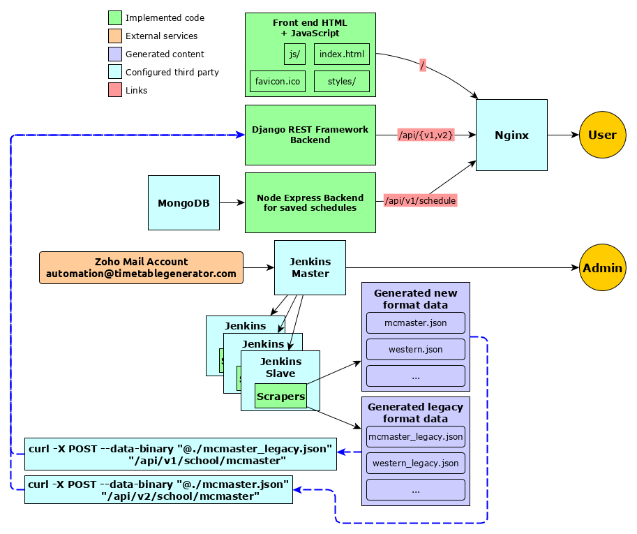
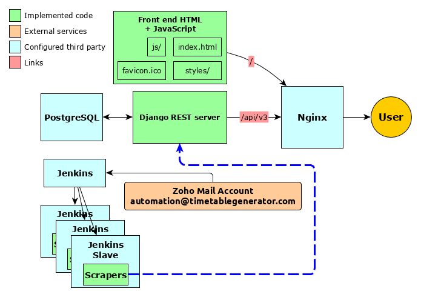
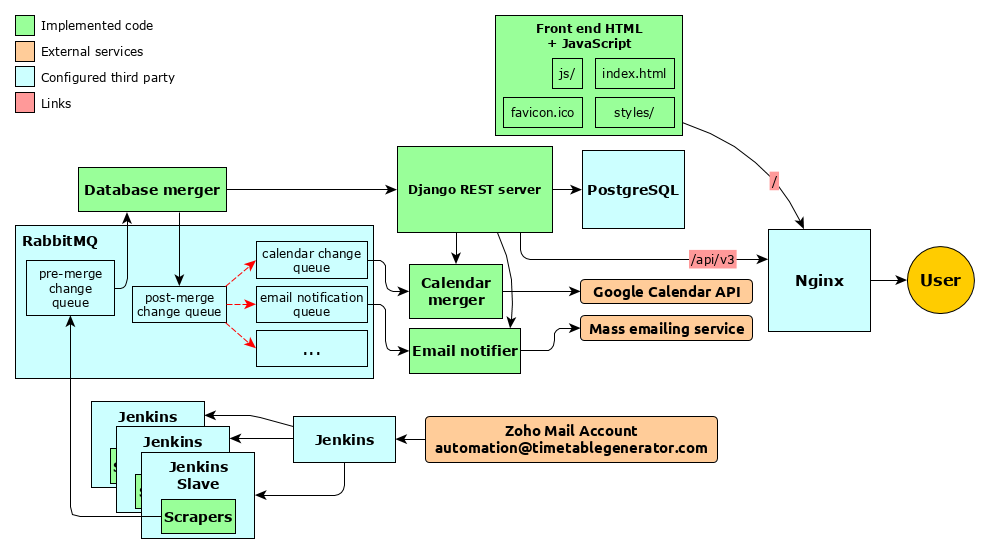

# Road map for the Timetable Generator

The Timetable Generator was relatively quiet from a development perspective since the first release. Most changes that occurred were in the backend, but almost none of them were visible from the user perspective.

The objective of this document was to establish goals to promote more regular development cycles and to make it easier to add additional developers to the project.

Given that this project has been shut down, this document now serves as a reference point to the overarching design at the time when the timetable generator was shutdown, and for future plans/improvements that never came to fruition.

## Current implementation

This diagram represents the current state of the system.

The Timetable Generator is currently composed of several components. They will be described in the following headings.

### Scrapers
The [scrapers](../scrapers) project was responsible for refreshing scheduling content from the various universities. The scrapers run periodically via [Jenkins](https://jenkins.io/), which logged and reported any failures via email. Each supported university had its own scraper, which typically ran once per day.

### API backend
The backend is a simple Django REST framework server essentially just functioning as a cache for static JSON scheduling data it reads on start and stores into memory. The plan was to extend it to eventually store the scheduling data in a data model. This was an intermediary migration from a static file server.

The API is implemented with the following endpoints:
- /api/v1/schedule/**&lt;key&gt;**
- /api/v1/school/**&lt;school_id&gt;**
- /api/v2/school/**&lt;school_id&gt;**/refresh
- /api/v1/school/**&lt;school_id&gt;**
- /api/v2/school/**&lt;school_id&gt;**/refresh

The Timetable Generator's API only returns a supported school's *entire* course scheduling content for the present time period. Historical changes are not preserved. In general, at least a few courses change daily in some way (e.g. TBA changed to time, instructor assigned. etc). `/api/v<1|2>/school/<school_id>` retrieves that data for some supported school. The `v1` and `v2` designations refer to the data format produced by the scrapers. Please refer to [this](TODO) document for understanding why there are multiple data formats and a technical breakdown of each's content.

The `/api/v<1|2>/school/<school_id>/refresh` endpoint was used by Jenkins to tell the API to re-cache the data from new files uploaded by the scraper for a particular school. These endpoints were not really necessary anymore after scheduling content stopped being "dropped in place" via FTP and was instead POST-ed to the API.

The `/api/v1/schedule/<schedule_key>` format was used for retrieving or saving timetables created by the site's users. This is handled by a node service that simply hashes the content and stores it in a MongoDB instance. It was created before the Django backend and could have easily been integrated into that rather than being a standalone service.

### Frontend HTML + JavaScript

The static files for the front end of the site. This was the least changed part of all the website over the years. It is mostly just some old version of JQuery with plain CSS and JavaScript.

Ideally, this shouldn't be salvaged and just replaced should someone pick up work on this project.

### Nginx

Nginx served as a proxy for all services involved in the API of the Timetable Generator as well as a host for the static content. All production services outside of scraping existed on a single virtual server. It also facilitated adding transparent HTTPS security via certificates created using [Let's Encrypt](https://letsencrypt.org/).

Scraping was handled elsewhere and update payloads of scheduling content were delivered via the API.

## Improvements

The following are ideas for improvements for the Timetable Generator that were never implemented. They are documented here for the sake of explaining the trajectory the website was headed in.

### Statefulness

The Timetable Generator is "dumb". It has no concept of state outside of the current state of the scheduling data. The scheduling data is essentially just a blob that isn't reasoned over at all outside of the front end. The timetables that users save are also blobs that just "invalidate" from year to year as the schedule is replaced.

Creating a data model for storing all of the data on the server opens up many possibilities.

Some examples:
- The API can be extended to not just return everything; we could drill down into what we want specifically (e.g. `/api/v3/school/mcmaster/2018/fall/courses/sfwreng3s03/sections`).
- We can retain historical data in an explorable way.
- We can compare data from previous years to current years (e.g. which professors tends to teach some course).

If we create user accounts, users can store their schedules over years/terms indefinitely. Knowing which courses a user is currently enrolled in also permits other functionality like:
- Notifying them when a course they have in their schedule has changed.
- Allowing them to selectively share their schedule(s) with other users.
- Facilitating data migrations (i.e. not causing breaking changes due to data being stored in two separate places, like in the current system).

In a stateful system, ideally the backend would exist as (or at least start as) a single piece supported by a feature-rich relational database (e.g. PostgreSQL).

### Incremental changes over snapshots

The timetable generator always suffered from being fragile. What was scraped successfully immediately went live and there was no analysis done to detect errors (e.g. a site's course count going from ~3000 to 5 due to a bug while scraping). There is too much fragile coupling between the scrapers, backend, and the frontend, which hinders testability and maintainabilty.

What the scrapers should instead do is create a "changelist" of how currently live data differs from what the data source (i.e. the university website) presents. A "diffable" data model is mostly implemented for the v3 data format (see [here](TODO)), which ideally would have been used to create the payload that scrapers generate.

Ideally, this changelist would be consumed by some reasoner that merges it into the current data set on the server. Interestingly, there could be multiple consumers of this changelist that do different things with it.

For example, upon successfully merging the changelist into the database, it could be passed onto further services that do things like:
- Create/manage Google Calendars for all users based on the courses they currently have in their timetable. The changelist would indicate which courses need to be updated on the calendar(s).
- Notify users when a course in their timetable has changed in some way (e.g. a professor or location being assigned).

This "changelist" pipe would ideally allow new services to simply subscribe to the pipe without needing to change any existing infrastructure. This decouples a lot of components of the project and allows them to follow the UNIX philosophy of "do one thing only and do it well". This also means components aren't tied to a particular programming language, allowing the best language to be selected for the job.

[RabbitMQ](https://www.rabbitmq.com/) is ideal to support this as it supports taking generic messages and enqueuing them in a database. They are not removed from the queue until the queue gets notified that the work has been processed. RabbitMQ also makes it easy to glue queues together; a queue A can automatically clone anything it receives to queues B and C for separate queue workers to pick up and process.

[Kafka](https://kafka.apache.org/) could also work where workers use offsets to keep track of where they are.

### Front-end Overhaul

This is pretty straight-forward. The timetable generator's front-end was always subpar to say the least. It wouldn't be too difficult to replace it with something much nicer using a Single Page App framework like [React](https://reactjs.org/) or [Vue.js](https://vuejs.org/) and a nice CSS library like [Bootstrap](https://getbootstrap.com/) or [Bulma](https://bulma.io/).