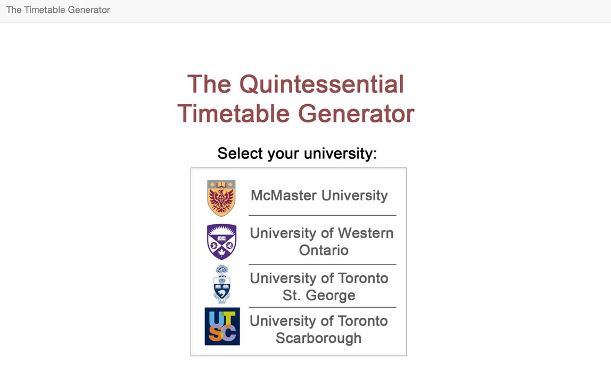
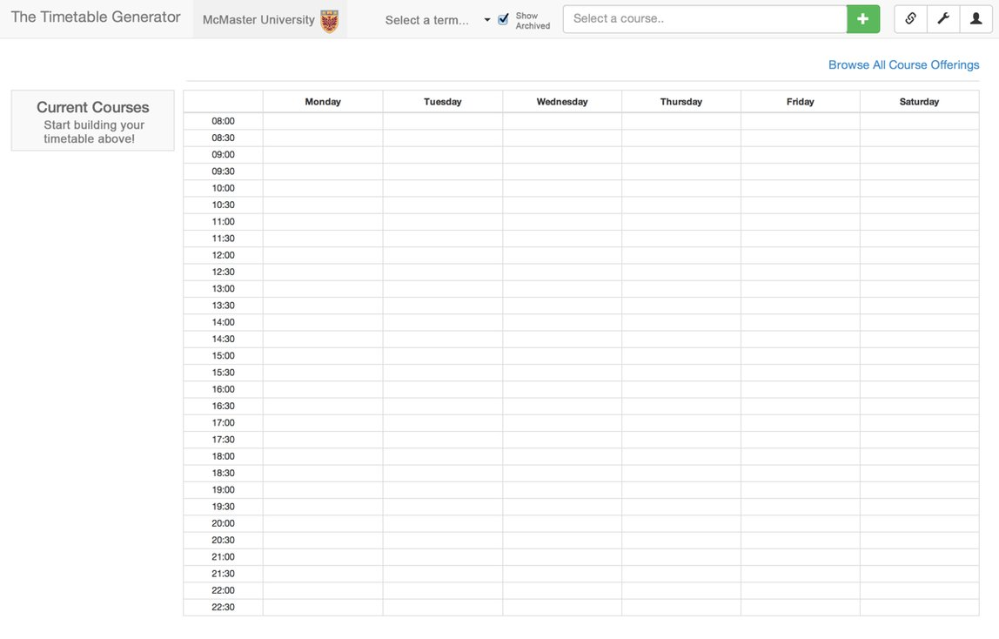
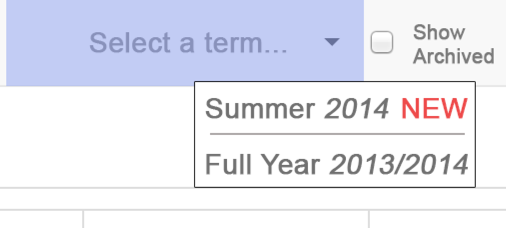
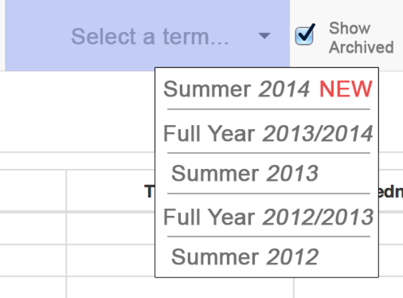
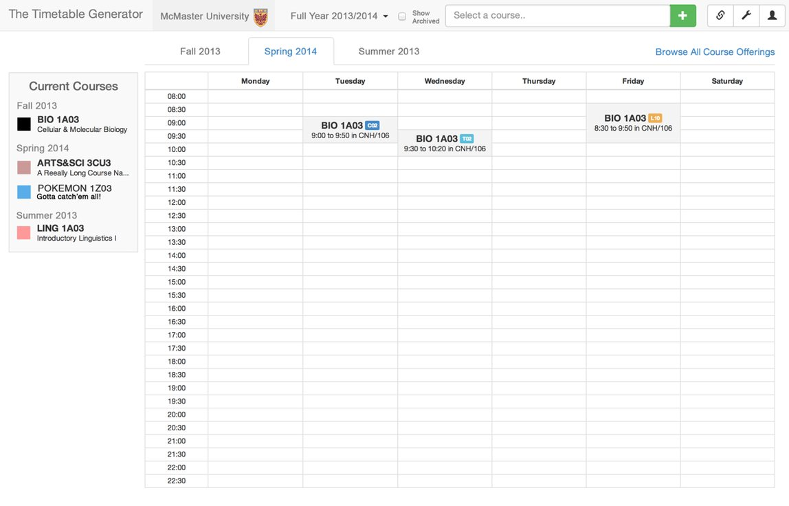

# Overview of the user frontend

The purpose of this document is to provide guidance for the general desired method of user interaction with The Timetable Generator. If this method of interaction is implemented in the user interface, it should allow for simpler extensibility and maintainability for both the front and back ends of the website.

As of the latest update to this document, all of the following images/diagrams are mockups and do not represent any existing assets.

## Site Entry Scenario

Upon entering the site, nothing should be displayed in terms of configuring the timetable. Only a list of selections for which school the user would like to create a timetable for should be displayed.

The following is a mock-up of what such a page may look like:

After a school is selected via click, the screen should be replaced by a blank timetable (we will ignore persisted data for now). Data pertaining to the school (e.g. available and archived terms to schedule over) should be loaded via the API at this point. For this example, we will pretend we chose *McMaster University*.

Notice that the timetable has stylized itself to show that it is set to McMaster University.

At this point, if the user would like to select a new school, they would need to either clear their cache or click a "back" button somewhere on the page. This has not been included in the above graphic.

From here, users will be first required to select a term to perform scheduling for. This is exemplified in the following:

The frontend should infer which terms are no longer relevant based on the current time. All terms are composed of a year and a term number, so inferring this should be trivial. Here we assume the current time is some point shortly after the start of the 2014 summer, and therefore "Summer 2014" is highlighted with "new".

Terms that are no longer relevant (already complete) are hidden, but still present for viewing historical terms or schedules (useful for when user accounts are implemented). They can be displayed by checking the *Show Archived* box.

Here is what would be displayed if that box were checked:

From here on out the idea is, a user selects a term and the *search* box next to the course reloads with the scheduling content relevant to that term. The term data is only downloaded once, and otherwise read from a cache.

Here is an example of a partially filled out timetable:

This schedule exemplifies scheduling over multiple terms. Choosing the *full year* term has allowed its sub-terms (fall and spring) to spawn as separate timetables in their own tabs. When the user clicks a tab that transitions to an unrelated term from the present one (e.g. *spring 2014* to *summer 2014*), the selected term for the search box should automatically switch with it on the top bar.

This is not finalized and still open for suggestion.
